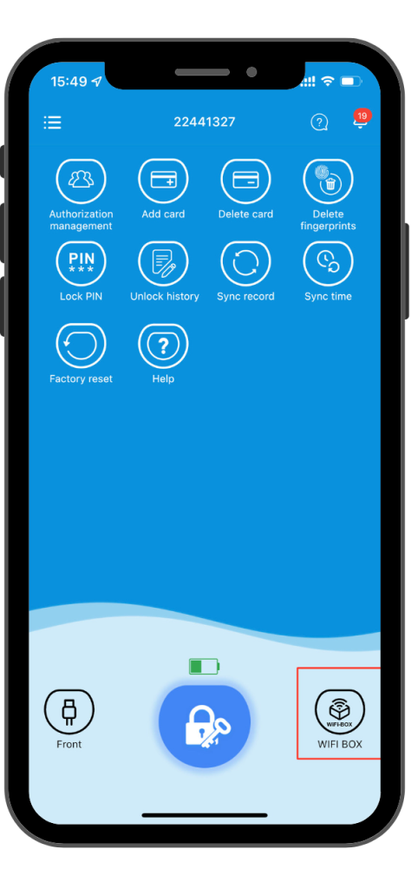

Mit dem Wi-Fi-Gateway können Sie:
- Türen von überall aus verriegeln/entriegeln
- Schlossstatus in Echtzeit überprüfen
- Benachrichtigungen empfangen

### Schritt 1

Kaufen Sie unser Gateway-Gerät. Um die Fernentriegelungsfunktion nutzen zu können, müssen Sie zunächst unser Gateway-Gerät erwerben. Dieses Gerät verbindet Ihr Schloss mit dem Internet und ermöglicht die Fernsteuerung über unsere Welock-App.

### Schritt 2

Binden Sie das Gateway an Ihr Schloss und die Welock-App. Nach dem Kauf des Gateways müssen Sie es mit Ihrem Schloss und unserer Welock-App verbinden. Dieser Vorgang ist einfach und kann innerhalb weniger Minuten abgeschlossen werden.

### Schritt 3
Wechseln Sie in den Wi-Fi-Fernmodus. Nach dem Binden des Gateways können Sie in den Wi-Fi-Fernmodus wechseln, indem Sie auf die Wi-Fi-Box-Schaltfläche unten rechts in der Welock-App klicken. Über der Schaltfläche wird eine Signalstärkeanzeige angezeigt.